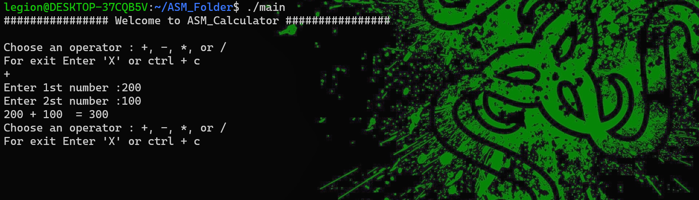

<p align="center">
    
</p>
<h1 align="center">Calculator_x64</h1>

<div align="center">
Calculator_x64 is a simple calculator written in assembly language.
</div>


<br />

<div align="center">
 
 

  

 

  

  

  
<!-- 
  -->

 
</div>





## 🎯 Features

- Addition
- Subtraction
- Multiplication  
- Division
- User friendly
- Easy installation process 
## ⚙️ Execute  
```bash
#To compile and run (development)
bash bash_asm.bashrc main.asm

#To execute 
./main.asm
```


## 🌱 Requirements 
- Linux Operating System
- Your process must be x86_64 to check run 
  ````bash
  uname -m
  ````
- First we need a assembler to compile our code. To install run 
  ```bash
  sudo apt-get install nasm

  # For more details run
  apt-cache show nasm 
  ````
- To generate a *.o (object file) run
  ```bash
  # This will generate a main.o file 
  nasm -f elf64 -o main.o main.asm  
  ```
- We can't execute a *.o file (object file ).

  We have to link it using linker to make it a executable file

  ld (it is a GNU linker )

  ```bash
  # For detail about ld linker run
  man ld 
  ```
- To generate a executable file from *.o file run 
  ```bash 
  #This will generate a 'main' executable file.
  ld main.o -o main
  ````
- Finally its time to run our application
  ```bash 
    ./main
  ````
- One bash script is there.

  which can do this  whole process of generating object.o file , linking and executing the executable file in just one line. 

  This is very useful for maining the *.asm code. 

  ```bash
  bash bash_asm.bashrc <FILENAME>.asm
  ```

## ‎‍💻 Author

- [@Piyush Ranjan](https://github.com/itsPiyush01)

## ⭐️ Contribute

If you want to say thank you and/or support the active development of example:

1. Add a GitHub Star to the project.
2. Tweet about the project on your Twitter.
3. Write a review or tutorial on Medium, Dev.to or personal blog.
4. Support the project by donating a cup of coffee.

## 🧾 License

MIT License Copyright (c) 2021 [Piyush Ranjan](https://github.com/itsPiyush).
